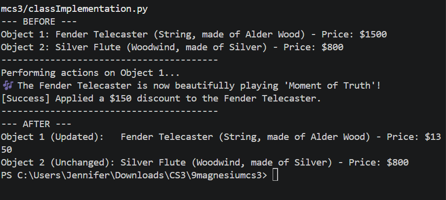
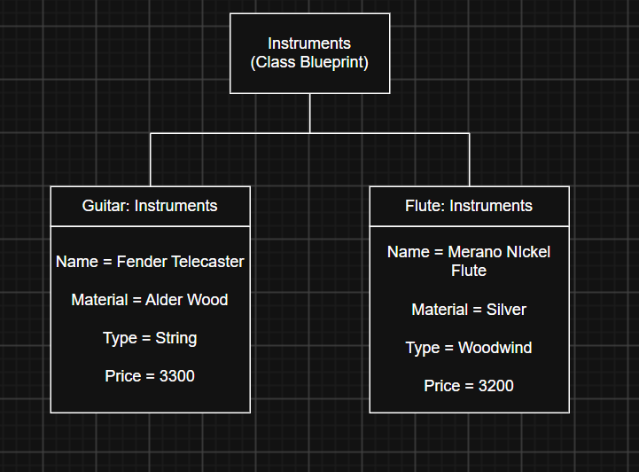

# Class Attributes and Methods

## Previous Design
Previous Activity:
[Link to original work](classObjecctUML.md)

## Design Revision
I turned attribute "Weight" into "Price" then turned it private.

## Visibility Decisions
| Attribute | Data Type | Visibility | Reason |
|---|---|---|---|
|Material |String |Public |Because users might want to see whether it is good or bad |
|Type |String |Public |So that they can find the specific category of instrument they need. |
|Price |Integer |Private |Because it is a value that should not be changed without control. |
|Name |String |Public |So that it can easily be identified |
## Updated UML Class Diagram

## Python Implementation

## Test Run

## Object Diagram

## Analysis
### Why did you make your chosen attribute private?
### Which method changes the state of your object?
### How did your two objects demonstrate that instances are independent?
### What is the difference between your class diagram and your object diagram?
