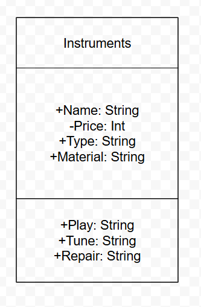

# Class Attributes and Methods

## Previous Design
Previous Activity:
[Link to original work](classObjecctUML.md)

## Design Revision
I turned attribute "Weight" into "isTuned" then turned it private.

## Visibility Decisions
| Attribute | Data Type | Visibility | Reason |
|---|---|---|---|
|Material |String |Public | |
|Type |String |Public | |
|isTuned |Boolean |Ptivate | |
|Name |String |Public | |
## Updated UML Class Diagram

## Python Implementation

[View Python Source](classImplementation.py)
## Test Run

## Object Diagram

## Analysis
### Why did you make your chosen attribute private?
### Which method changes the state of your object?
### How did your two objects demonstrate that instances are independent?
### What is the difference between your class diagram and your object diagram?